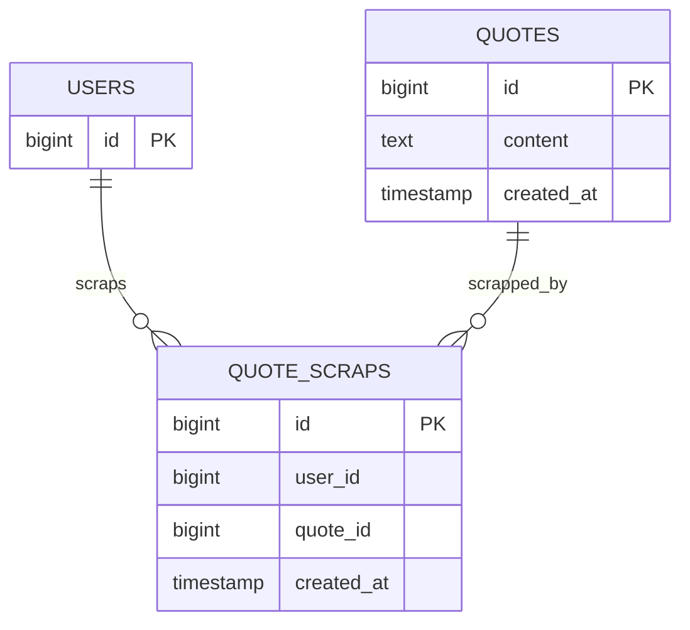

# 발견탭 API 구현 계획

## 목표

발견탭은 로그인 사용자가 추천받은 문장을 다시 탐색할 수 있는 목록 API다.
목록에는 누군가에게 한 번이라도 추천된 문장만 노출한다.

첫 구현 범위는 랜덤 문장 10개 조회까지였다.
이후 커서 페이지네이션, 장르 필터, 스크랩 생성/삭제 API를 별도 작업으로 확장했다.

관련 이슈: #96

## API

아래 API 경로는 서버 context-path `/api`를 포함한 공개 경로로 표기한다.

```text
GET /api/discovery/quotes
Authorization: Bearer {accessToken}
```

### 인증 정책

이 API는 로그인한 사용자만 호출할 수 있다.
access token이 없거나 만료/조작된 경우 기존 인증 에러 응답을 사용한다.
비로그인 요청에 대한 `isScrapped=false` 응답은 지원하지 않는다.
응답의 `isScrapped`는 요청한 로그인 사용자를 기준으로 계산한다.

### 응답

```json
{
  "quotes": [
    {
      "quoteId": 1,
      "bookId": 1,
      "recommendedUserId": 1,
      "content": "새는 알에서 나오려고 투쟁한다.",
      "title": "데미안",
      "author": "헤르만 헤세",
      "bookCoverImageUrl": "https://cdn.example.com/book-cover-placeholder.png",
      "recommendedAt": "2026-06-05T12:34:56",
      "isScrapped": false
    }
  ]
}
```

| 필드 | 설명 |
|------|------|
| `quoteId` | 문장 ID. 문장 상세 또는 스크랩 API에서 사용할 값 |
| `bookId` | 책 ID. 책 상세 화면으로 확장할 때 사용할 값 |
| `recommendedUserId` | 이 문장을 추천받은 사용자 ID |
| `content` | 문장 내용 |
| `title` | 책 제목 |
| `author` | 저자 |
| `bookCoverImageUrl` | 책 표지 이미지 URL |
| `recommendedAt` | 문장이 추천 이력에 등록된 시각 |
| `isScrapped` | 로그인 사용자가 해당 문장을 스크랩했는지 여부 |

## DB

발견탭 후보 문장 전용 테이블은 만들지 않는다.
기존 추천 이력 테이블을 기준으로 후보를 만든다.

```sql
SELECT
    quote_id,
    user_id AS recommended_user_id,
    created_at AS recommended_at
FROM daily_recommendations

UNION ALL

SELECT
    daily_recommendation_quotes.quote_id,
    daily_recommendations.user_id AS recommended_user_id,
    daily_recommendation_quotes.created_at AS recommended_at
FROM daily_recommendation_quotes
JOIN daily_recommendations
    ON daily_recommendations.id = daily_recommendation_quotes.daily_recommendation_id
```

같은 문장이라도 추천받은 사용자가 다르면 서로 다른 발견탭 카드로 노출할 수 있다.
중복 제거 기준은 `quoteId` 단독이 아니라 `recommendedUserId + quoteId` 조합이다.
같은 사용자가 같은 문장을 여러 번 추천받은 경우에는 최신 추천 이력 1개를 대표로 사용한다.
삭제된 문장이나 삭제된 책은 응답에서 제외한다.

### 신규 테이블

스크랩 여부 조회 기반으로 `quote_scraps` 테이블을 추가한다.
#96 발견탭 작업에서는 조회만 사용했고, #100 스크랩 작업에서 생성/삭제 API를 추가한다.
스크랩은 추천 이력이나 추천받은 사용자가 아니라 로그인 사용자와 문장 ID를 기준으로 저장한다.

```sql
CREATE TABLE IF NOT EXISTS quote_scraps (
    id BIGINT GENERATED ALWAYS AS IDENTITY PRIMARY KEY,
    user_id BIGINT NOT NULL,
    quote_id BIGINT NOT NULL,
    created_at TIMESTAMP NOT NULL DEFAULT CURRENT_TIMESTAMP
);

CREATE UNIQUE INDEX IF NOT EXISTS quote_scraps_user_quote_uidx
    ON quote_scraps (user_id, quote_id);

CREATE INDEX IF NOT EXISTS quote_scraps_quote_id_idx
    ON quote_scraps (quote_id);
```

프로젝트 DB 규칙에 따라 Foreign Key는 추가하지 않는다.

### 신규 인덱스

추천 이력에서 후보를 모으므로 다음 인덱스를 추가한다.

```sql
CREATE INDEX IF NOT EXISTS daily_recommendations_quote_id_idx
    ON daily_recommendations (quote_id);

CREATE INDEX IF NOT EXISTS daily_recommendation_quotes_quote_id_idx
    ON daily_recommendation_quotes (quote_id);
```

## 구현 순서

1. Flyway migration을 추가한다.
   - `quote_scraps` 테이블 생성
   - 추천 이력 `quote_id` 조회 인덱스 추가
2. 스크랩 테이블 매핑을 만든다.
   - `QuoteScrapTable`
   - 발견탭에서는 별도 스크랩 service/repository를 호출하지 않는다.
   - `DiscoveryRepository`에서 `quote_scraps`를 직접 left join해 `isScrapped`를 계산한다.
3. 발견탭 조회 repository를 만든다.
   - 추천 이력에서 후보 `quote_id`, 추천받은 `user_id`, 추천 이력 `created_at`을 조회한다.
   - 같은 `recommendedUserId + quoteId` 조합이 여러 번 추천됐으면 최신 추천 이력 1개를 대표로 사용한다.
   - 같은 `quoteId`라도 `recommendedUserId`가 다르면 별도 카드로 응답할 수 있다.
   - `quotes`, `books`를 join한다.
   - `quote_scraps`를 로그인 사용자 ID 기준으로 left join하고 `quote_scraps.id IS NOT NULL`을 `isScrapped`로 변환한다.
   - `ORDER BY random()`과 `LIMIT 10`으로 랜덤 목록을 가져온다.
4. usecase와 service를 구성한다.
   - `DiscoveryUseCase`에 `@Transactional(readOnly = true)`를 선언한다.
   - `DiscoveryService`는 발견탭 조회 정책만 맡는다.
5. controller를 추가한다.
   - `DiscoveryController`
   - `GET /api/discovery/quotes`
   - `@AuthenticationPrincipal AuthenticatedUser`로 인증 사용자를 받는다.
6. OpenAPI 설명과 DTO를 추가한다.
   - `DiscoveryQuoteResponse`
   - `DiscoveryQuotesResponse`

## 예외와 경계 조건

추천 이력이 없으면 빈 목록을 반환한다.
추천된 문장이 10개 미만이면 가능한 개수만 반환한다.
같은 `recommendedUserId + quoteId` 조합이 여러 추천 이력에 있어도 한 번만 반환한다.
같은 문장이라도 추천받은 사용자가 다르면 여러 번 반환될 수 있다.

인증 실패 처리 방식은 기존 JWT 필터와 security entry point를 따른다.

## 테스트

단위 테스트는 다음 시나리오를 검증한다.

- 로그인 사용자는 스크랩한 문장만 `isScrapped=true`로 응답한다.
- 후보 추천 이력이 중복되어도 같은 `recommendedUserId + quoteId` 조합은 한 번만 응답한다.
- 같은 `quoteId`라도 추천받은 사용자가 다르면 별도 응답으로 포함될 수 있다.
- 추천 이력이 없으면 빈 목록을 반환한다.
- 응답에 `recommendedUserId`, `recommendedAt`이 포함된다.

repository SQL은 jOOQ `MockConnection`으로 핵심 쿼리 형태를 검증한다.
최종 검증은 다음 명령으로 수행한다.

```bash
cd app && ./gradlew testClasses
cd app && ./gradlew test
cd app && ./gradlew lintKotlin
cd app && ./gradlew detekt
```

포맷 수정이 필요한 경우 push 전에 `cd app && ./gradlew formatKotlin`을 실행한다.

## 후속 작업

커서 기반 무한스크롤은 `docs/discovery-pagination-implementation.md` 기준으로 정리했다.
장르 필터는 `docs/discovery-genre-filter-implementation.md` 기준으로 정리했다.
스크랩 생성/삭제 API는 `docs/quote-scrap-api.md` 기준으로 정리했다.

마이페이지 스크랩 모아보기 API와 선택 삭제 API는 스크랩 API 작업 범위에서 구현한다.

```text
GET /api/my-page/scrapped-quotes?cursor={cursor}&limit={limit}
POST /api/quote-scraps/bulk-delete
```

마이페이지 스크랩 목록은 `totalCount`, `quotes`, `nextCursor`, `hasNext`를 한 번에 반환한다.
`totalCount`는 책 개수가 아니라 로그인 사용자가 스크랩한 문장 개수다.
목록 항목은 책 이미지, 문장, 책 제목, 작가를 포함한다.
페이지네이션은 `scrappedAt DESC, quoteId DESC` 커서 기반 무한스크롤로 구현하고, `limit`는 기본 10개, 최대 50개로 둔다.
다중 취소 API는 최대 50개의 `quoteIds` 배열을 받아 로그인 사용자의 스크랩만 삭제하고, 이미 취소된 문장이 포함되어도 성공 처리한다.
발견탭 단건 스크랩 API를 토글 API로 바꾸지 않고, 화면 상태에 따라 `PUT /api/quotes/{quoteId}/scrap` 또는 `DELETE /api/quotes/{quoteId}/scrap`을 호출한다.

## PR 설명에 포함할 내용

API 응답 예시는 이 문서의 `응답` 섹션 JSON을 사용한다.
`users`, `quotes`, `quote_scraps`의 개념 관계는 다음 Mermaid를 사용한다.



이 관계도는 DB Foreign Key가 아니라 애플리케이션에서 ID로 연결하는 개념 관계다.
